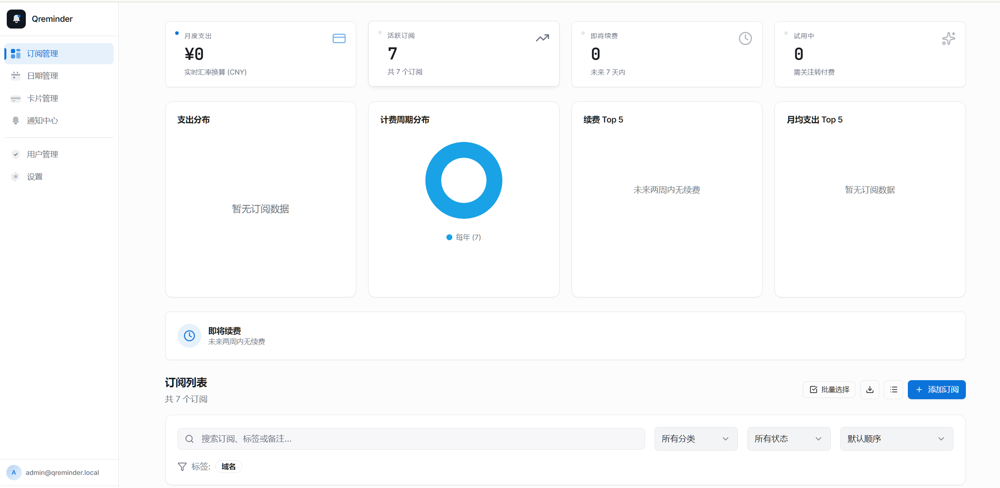
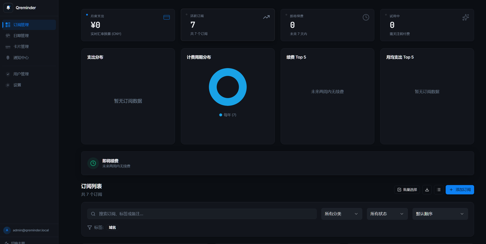

# Qreminder

[简体中文](README.md) | [English](README.en.md)

Qreminder 是一个自托管的订阅管理工具。把 SaaS、AI 工具、云服务和开发工具的价格、续费日、预算和提醒放到一起；适合个人、独立团队和家庭实验室。

<p align="center">
  
  
  
  
  
  
</p>

<p align="center">
  
  
</p>

## 这是什么

如果你同时订了很多工具，Qreminder 帮你把它们记清楚：

- **谁什么时候扣费**——多档提醒（如 `[7, 3, 1]` 天），按日聚合避免邮件轰炸
- **每月大概花多少**——不同周期统一折算成月度成本，再按分类、付款方式拆解
- **哪些快到期**——续费日历 + 试用到期高亮 + 仪表盘续费排行
- **通知发去哪了**——通知中心独立页，可下钻到「这条订阅，哪个收件人，发送状态」

数据自托管：你的订阅信息只存在你部署的实例里，不上报任何第三方。

## 功能

| 类别 | 能力 |
| --- | --- |
| **订阅记录** | 名称、Logo、价格、币种、扣费周期（周/月/季/半年/年/自定义天数）、状态（试用/订阅中/暂停/取消）、分类、付款方式（含「免费」）、网站、标签、备注 |
| **多档提醒** | 每条订阅独立 `reminderOffsets`，同日命中合并为一条通知 |
| **通知渠道** | Telegram、邮件（SMTP）、企业微信机器人、Webhook、Bark、NotifyX——6 种渠道可同时启用 |
| **通知中心** | 独立页汇总「即将发送」与「历史任务」，按状态筛选，单条任务可下钻每个收件人结果 |
| **支出分析** | 周期折算月度成本、分类占比、付款方式占比、扣费周期分布、续费/月度 Top 5 |
| **多币种** | 可选 Frankfurter 或 FloatRates 汇率源；远端不可用时回退备用汇率 |
| **多用户** | Better Auth 邮箱密码登录；管理员可在「设置 → 注册管理」临时打开注册，勾选常用邮箱域名或手动添加白名单 |
| **管理员** | 侧边栏「用户管理」直接增删账号、重置密码、封禁 |
| **双语界面** | 简体中文 / English 任意切换 |
| **多主题** | Emerald / Ocean / Sunset / Lavender / Rose 五套预设主题，配 Light/Dark 模式，自定义主题色支持 |

## 通知配置指南

在 **设置 → 通知设置** 中启用渠道并填写对应凭据，点击「测试」按钮验证连通性。

### Telegram（推荐，最简单）

1. 在 Telegram 搜索 [@BotFather](https://t.me/botfather)，发送 `/newbot`，按提示创建机器人，获得 **Bot Token**
2. 把机器人拉进你想接收通知的群组（或直接给机器人发一条消息）
3. 访问 `https://api.telegram.org/bot<你的Token>/getUpdates`，找到 `chat.id` 字段
4. 在设置页填入 Bot Token 和 Chat ID，点击测试

### 邮件（SMTP）

填写任意 SMTP 服务商的凭据。常见选择：

| 服务商 | SMTP 地址 | 端口 | 备注 |
| --- | --- | --- | --- |
| **Resend** | `smtp.resend.com` | 465 (SSL) | 免费额度 100 封/天，需验证域名 |
| **Gmail** | `smtp.gmail.com` | 587 (TLS) | 需开启「应用专用密码」 |
| **Outlook** | `smtp.office365.com` | 587 (TLS) | 使用账号密码 |
| **QQ 邮箱** | `smtp.qq.com` | 465 (SSL) | 需开启 SMTP 并获取授权码 |
| **163 邮箱** | `smtp.163.com` | 465 (SSL) | 需开启 SMTP 并获取授权码 |

填写：SMTP 服务器、端口、用户名、密码、发件人地址、收件人地址，点击测试。

### 企业微信机器人

1. 在企业微信群聊中添加「群机器人」，获得 Webhook URL
2. 在设置页粘贴 Webhook URL，选择消息格式（text 或 markdown），点击测试

### Webhook（通用）

适合对接任意支持 HTTP 回调的服务（如 n8n、IFTTT、自建服务）：

- 填写目标 URL
- 选择 HTTP 方法（POST/GET）
- 可选：自定义 Headers（JSON 格式）和 Payload 模板

### Bark（iOS 推送）

1. 在 App Store 下载 [Bark](https://apps.apple.com/app/bark/id1403753865)
2. 打开 App 复制设备 Key
3. 在设置页填入服务器地址（默认 `https://api.day.app`）和设备 Key，点击测试

### NotifyX

1. 注册 [NotifyX](https://www.notifyx.cn/) 账号，获取 API Key
2. 在设置页填入 API Key，点击测试

## 应用结构

| 路由 | 用途 |
| --- | --- |
| `/` | 仪表盘：月度支出、活跃订阅数、即将续费、试用到期统计；下方是带筛选与排序的订阅网格/列表 |
| `/calendar` | 续费日历：按月查看续费事件，hover 查看金额 |
| `/cards` | 卡片管理：按付款方式分组聚合订阅 |
| `/notifications` | 通知中心：即将发送 + 历史任务（带钻取） |
| `/settings` | 系统设置：账号、外观、汇率、通知渠道、注册管理、自定义配置 |
| `/admin/users` | 用户管理（admin only） |
| `/login` `/register` `/forgot-password` `/reset-password` | 认证流程 |

## 技术形态

| 包 | 说明 |
| --- | --- |
| [packages/client](./packages/client/) | Vite + React 19 + Tailwind 4 + shadcn/Radix SPA。统一 design system：5 级 elevation、surface/lift utility、Apple-style motion easing，中英双语 |
| [packages/server-ts](./packages/server-ts/) | TypeScript + Hono + Drizzle + Better Auth 后端，一份代码经两种 runtime 部署 |
| [runtimes/worker](./runtimes/worker/) | Cloudflare Workers + D1 + R2 + Cron Triggers + Workers Assets——免 VPS |
| [runtimes/node](./runtimes/node/) | Node + better-sqlite3 + nodemailer + node-cron——跑在自己的 VPS |
| [packages/shared](./packages/shared/) | 前后端共享的 zod schema 与领域工具 |
| [tools/pb-importer](./tools/pb-importer/) | 把旧版 Go + PocketBase 数据导入新 schema 的 CLI |

## Cloudflare Workers 部署（推荐）

只需要一个 Cloudflare 账号。整个应用跑在 Cloudflare 免费档（D1 + R2 + Workers + Cron Triggers + Workers Assets）。

### 路径 A：fork + GitHub Actions（无需本地命令行）

适合不想买 VPS、也不想本地装命令行的用户。fork 这个仓库后，全程在 GitHub 网页里完成部署。

1. 仓库 **Settings → Environments** 建一个 `cloudflare` environment，按 [docs/CF_GH_ACTIONS_DEPLOY.md §1](./docs/CF_GH_ACTIONS_DEPLOY.md#1-配置-github-secrets--variables) 配置必填 secret
2. **Actions** → 手动运行 **Cloudflare Bootstrap**（创建 D1 + R2，自动 commit `database_id` 回 `wrangler.toml`），随后 **Wrangler Deploy** 自动跑起来部署 worker

完整步骤、首次 admin 登录、绑域名和故障排查见 [docs/CF_GH_ACTIONS_DEPLOY.md](./docs/CF_GH_ACTIONS_DEPLOY.md)。

### 路径 B：本地 wrangler CLI

```bash
pnpm install -g wrangler@latest
wrangler login
```

然后照 [docs/WORKER_DEPLOY.md](./docs/WORKER_DEPLOY.md) 的清单依次：建 D1 + R2 → 填 secrets → 应用 D1 migrations → 构建前端 → `wrangler deploy` → 登录默认 admin。

### 首次登录

部署完成后用以下默认凭据登录，系统会强制你立即修改密码：

```
邮箱：  admin@qreminder.local
密码：  Qreminder@2026
```

## Node 自托管部署（Docker）

如果你有自己的 VPS，整个应用打成一个 Docker 镜像：v2 TS 后端 + 前端 SPA + SQLite + 内置 cron 调度器全在一个容器里。

```bash
mkdir -p qreminder && cd qreminder
curl -fsSL https://raw.githubusercontent.com/yzgolden86/Qreminder/main/runtimes/node/docker-compose.yml -o docker-compose.yml
curl -fsSL https://raw.githubusercontent.com/yzgolden86/Qreminder/main/runtimes/node/.env.example -o .env

# 编辑 .env：至少填好 BETTER_AUTH_SECRET 和 APP_URL
docker compose pull
docker compose up -d
```

镜像默认从 `ghcr.io/yzgolden86/qreminder:latest` 拉。完整步骤、首次 admin 登录、反向代理 + 自定义域名、备份与故障排查见 [docs/NODE_DOCKER_DEPLOY.md](./docs/NODE_DOCKER_DEPLOY.md)。

不想用 Docker，可以直接源码起：

```bash
git clone https://github.com/yzgolden86/Qreminder.git
cd Qreminder
pnpm install --frozen-lockfile
pnpm --filter @qreminder/client build
pnpm --filter @qreminder/runtime-node start
```

## 本地开发

```bash
pnpm install

# v2 TS 后端（Node runtime，监听 :3000）
pnpm --filter @qreminder/runtime-node dev

# 前端 SPA（http://localhost:5173，/api 代理到 :3000）
pnpm --filter @qreminder/client dev
```

提交前常用的检查：

```bash
pnpm -r typecheck
pnpm --filter @qreminder/client test
pnpm --filter @qreminder/client build
```

## 数据迁移（v1 → v2）

如果你在跑 v1 Go + PocketBase 版本，可以用 [tools/pb-importer](./tools/pb-importer/) 把旧数据导入 v2：

```bash
pnpm --filter @qreminder/pb-importer build
node tools/pb-importer/dist/cli.js \
  --pb /path/to/pb_data \
  --target sqlite:///data/qreminder.db \
  --fs /data/assets
```

工具不会删除源数据，迁移失败可重跑。

## 参与贡献

欢迎提交 issue、改进文档、补充测试或发起 pull request。提交变更前请运行相关的检查命令，并让文档、测试和实现保持同步。

如果你准备贡献较大的功能，建议先开 issue 说明目标、使用场景和大致方案，方便在实现前对齐方向。

## 友情链接

- [LINUX DO](https://linux.do/)：Qreminder 认可并感谢 LINUX DO 社区对开源项目交流的支持。

## 许可证

Qreminder 基于 [MIT License](LICENSE) 开源。Copyright © 2024-2026 yzgolden86。
